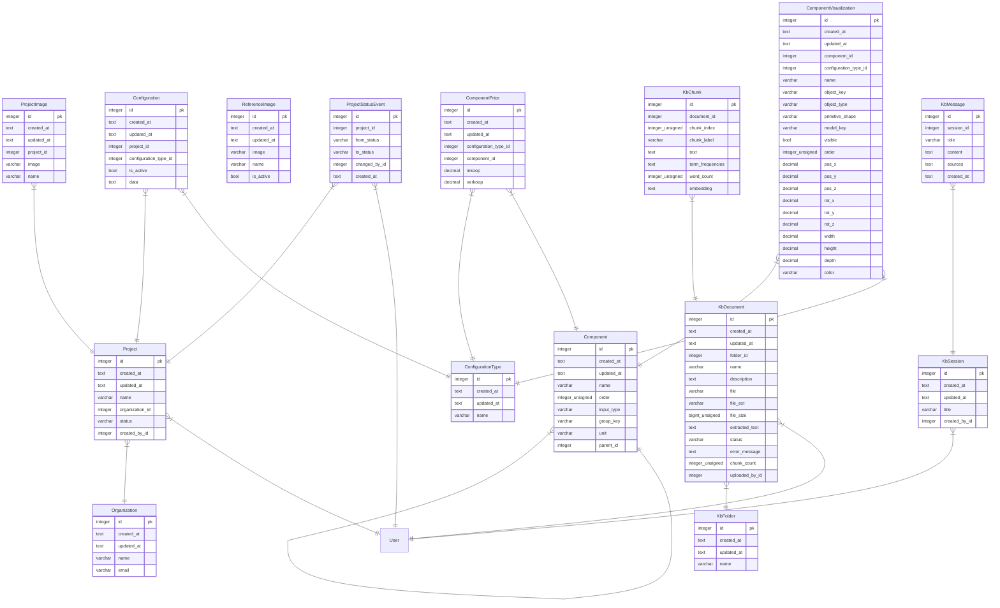

```mermaid
erDiagram
Organization {
  integer id pk
  text created_at 
  text updated_at 
  varchar name 
  varchar email 
}
Project {
  integer id pk
  text created_at 
  text updated_at 
  varchar name 
  integer organization_id 
  varchar status 
  integer created_by_id 
}
ProjectStatusEvent {
  integer id pk
  integer project_id 
  varchar from_status 
  varchar to_status 
  integer changed_by_id 
  text created_at 
}
ProjectImage {
  integer id pk
  text created_at 
  text updated_at 
  integer project_id 
  varchar image 
  varchar name 
}
ReferenceImage {
  integer id pk
  text created_at 
  text updated_at 
  varchar image 
  varchar name 
  bool is_active 
}
ConfigurationType {
  integer id pk
  text created_at 
  text updated_at 
  varchar name 
}
Component {
  integer id pk
  text created_at 
  text updated_at 
  varchar name 
  integer_unsigned order 
  varchar input_type 
  varchar group_key 
  varchar unit 
  integer parent_id 
}
ComponentPrice {
  integer id pk
  text created_at 
  text updated_at 
  integer configuration_type_id 
  integer component_id 
  decimal inkoop 
  decimal verkoop 
}
Configuration {
  integer id pk
  text created_at 
  text updated_at 
  integer project_id 
  integer configuration_type_id 
  bool is_active 
  text data 
}
ComponentVisualization {
  integer id pk
  text created_at 
  text updated_at 
  integer component_id 
  integer configuration_type_id 
  varchar name 
  varchar object_key 
  varchar object_type 
  varchar primitive_shape 
  varchar model_key 
  bool visible 
  integer_unsigned order 
  decimal pos_x 
  decimal pos_y 
  decimal pos_z 
  decimal rot_x 
  decimal rot_y 
  decimal rot_z 
  decimal width 
  decimal height 
  decimal depth 
  varchar color 
}
KbFolder {
  integer id pk
  text created_at 
  text updated_at 
  varchar name 
}
KbDocument {
  integer id pk
  text created_at 
  text updated_at 
  integer folder_id 
  varchar name 
  text description 
  varchar file 
  varchar file_ext 
  bigint_unsigned file_size 
  text extracted_text 
  varchar status 
  text error_message 
  integer_unsigned chunk_count 
  integer uploaded_by_id 
}
KbChunk {
  integer id pk
  integer document_id 
  integer_unsigned chunk_index 
  varchar chunk_label 
  text text 
  text term_frequencies 
  integer_unsigned word_count 
  text embedding 
}
KbSession {
  integer id pk
  text created_at 
  text updated_at 
  varchar title 
  integer created_by_id 
}
KbMessage {
  integer id pk
  integer session_id 
  varchar role 
  text content 
  text sources 
  text created_at 
}
Component }|--|| Component: ""
KbChunk }|--|| KbDocument: ""
KbMessage }|--|| KbSession: ""
KbSession }|--|| User: ""
ProjectImage }|--|| Project: ""
ComponentPrice }|--|| ConfigurationType: ""
ComponentPrice }|--|| Component: ""
ComponentVisualization }|--|| Component: ""
ComponentVisualization }|--|| ConfigurationType: ""
Configuration }|--|| Project: ""
Configuration }|--|| ConfigurationType: ""
KbDocument }|--|| KbFolder: ""
KbDocument }|--|| User: ""
Project }|--|| Organization: ""
Project }|--|| User: ""
ProjectStatusEvent }|--|| Project: ""
ProjectStatusEvent }|--|| User: ""
```
